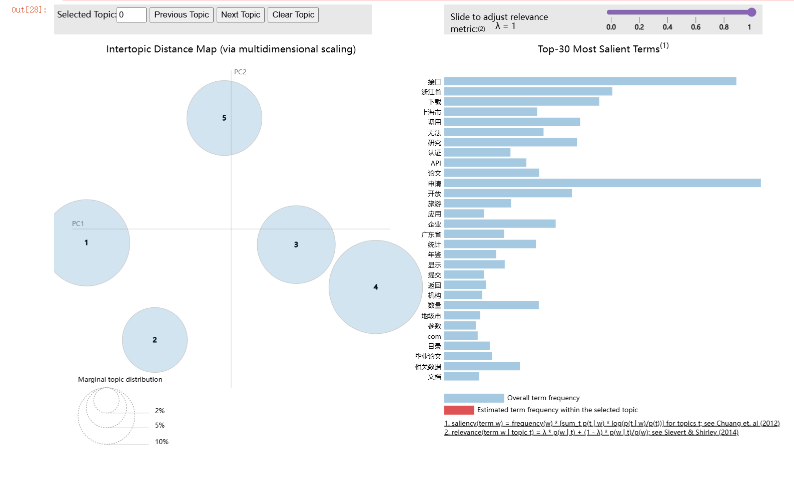

# Open Government Data User Feedback Analysis

基于开放政府数据平台用户反馈，使用 Python、Pandas、Jieba、Gensim 和 LDA 进行中文文本清洗、主题建模与用户需求分析。

## 项目目标

本项目主要关注：

- 用户反馈中主要存在哪些需求与使用障碍？
- 如何通过文本预处理将原始中文反馈转换为可建模语料？
- 不同主题数量下，LDA 模型的主题一致性表现如何？
- 如何结合关键词、代表评论及可视化解释最终主题？

## 数据与预处理

原始数据：

- 用户反馈数量：**3,878 条**

主要处理流程：

- 完全重复文本去重
- HTML、URL、邮箱、手机号等规范化与隐私脱敏
- Jieba 中文分词
- 词性筛选
- 自定义停用词过滤
- 词典低频词过滤
- Bag-of-Words 语料构建

经过文本清洗、空语料过滤及词典过滤后，最终形成：

- **3,817 条有效建模语料**
- Dictionary size：**1,479**

## 分析流程

Raw User Feedback  
→ Data Cleaning  
→ Jieba Tokenization  
→ POS Filtering  
→ Stopword Filtering  
→ Dictionary & Bag-of-Words  
→ LDA Topic Modeling  
→ Coherence Comparison  
→ Topic Interpretation  
→ pyLDAvis Visualization

## 模型选择

对主题数 `K = 5–10` 进行 Coherence 比较：

| K | Coherence |
|---:|---:|
| 5 | **0.4661** |
| 6 | 0.4251 |
| 7 | 0.4026 |
| 8 | 0.4272 |
| 9 | 0.4112 |
| 10 | 0.4511 |

在本项目测试的候选范围内，**K=5 的 Coherence 得分最高（0.4661）**，因此选择 5 个主题进行后续解释。

> K=5 是在本项目测试范围 K=5–10 内的候选结果，不代表全局最优主题数。

## 主题分析结果

最终识别出 5 类核心主题：

| Topic | 主题 | 评论数 | 占比 |
|---:|---|---:|---:|
| 1 | API接口调用与技术故障 | 1,047 | **27.43%** |
| 2 | 数据资源供给与平台使用支持 | 468 | 12.26% |
| 3 | 专业专题与科研数据需求 | 705 | 18.47% |
| 4 | 论文研究与综合统计数据需求 | 891 | **23.34%** |
| 5 | 公共数据开放规则与申请反馈机制 | 706 | 18.50% |

其中：

- **API接口调用与技术故障**占比最高，为 27.43%
- **论文研究与综合统计数据需求**占 23.34%
- 用户反馈不仅包含数据获取需求，也反映了接口调用、平台使用支持以及开放申请机制等问题

## LDA 可视化

pyLDAvis 用于辅助观察：

- 不同主题之间的相对位置与相似程度
- 各主题的相对权重
- 不同主题中的高相关词项

> pyLDAvis 中的 PC1、PC2 为降维后的可视化坐标，本身不具有直接业务含义。

## 技术栈

- Python
- Pandas
- Jieba
- Gensim
- Bag-of-Words
- LDA
- pyLDAvis
- Jupyter Notebook

## 项目文件

- `government_data_feedback_analysis.ipynb`：完整数据清洗、文本处理、LDA 建模与主题分析过程
- `lda_topic_visualization.png`：LDA / pyLDAvis 主题可视化结果

## 项目局限

- LDA 属于无监督概率主题模型，主题标签需要结合关键词与代表文本进行人工解释。
- Coherence 仅用于辅助比较候选主题数量，不能单独证明模型具有唯一最优结构。
- 模型结果对随机种子存在一定敏感性，因此不将本项目结果表述为“高度稳定”或“完全稳健”。
- 最大主题概率归类用于统计主题分布，但每条文本本质上仍可能同时具有多个主题概率。
